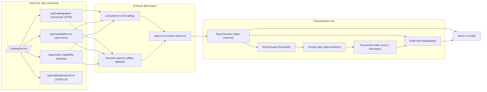
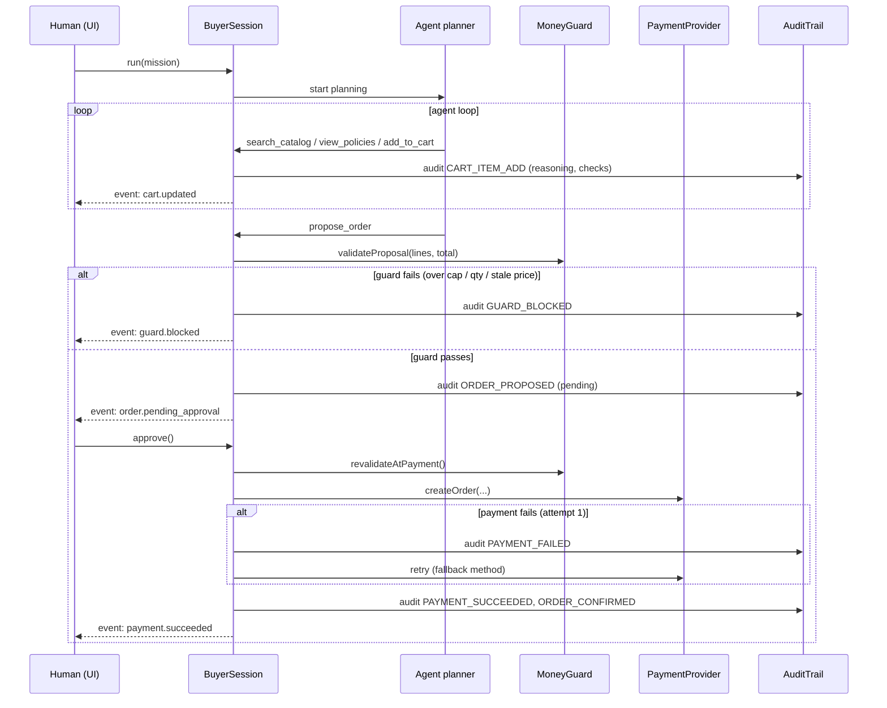

# Architecture — Agent-Readable Commerce (AI Buyer)

Razorpay Buildathon · Track 01 · **Make a merchant transactable by an AI buyer, end to end.**

This document explains *why* the system is shaped the way it is. The core
argument is that the money path must be **bounded, gated and explainable** —
everything else follows from that.

---

## 1. The problem, restated

An AI buyer is a program that can act on your store. Two things have to be true
for that to work and to be *safe*:

1. **Discoverable & parseable** — the store must expose its catalog in a form an
   LLM/agent can consume directly (not just HTML marketing pages).
2. **Transactionally safe** — an agent must be able to *buy* without being able
   to *charge*. The human is the only party allowed to trigger a charge.

Our design makes #1 a first-class API surface and #2 an architectural invariant
(the agent's tool surface physically cannot charge).

---

## 2. Component diagram

---

## 3. The buy flow (sequence)

---

## 4. Why the money path looks like this

### 4.1 Bounded — `guards/moneyGuards.ts`
- Every proposed order is checked against caps: **order total ≤ ₹25,000**,
  **qty ≤ 5 per line**, **≤ 10 line items**, positive amounts, INR only.
- Price and stock are **snapshotted at cart-add time** and **re-validated at
  payment time** — closing the TOCTOU window (an order can't silently grow if a
  price changed or stock ran out between proposal and charge).
- The agent is never handed an unbounded money tool.

### 4.2 Gated — `agent/tools.ts` + `agent/session.ts`
- The agent's *entire* tool surface is: search, get product, view policies,
  add/remove cart, get cart, **propose_order**. There is **no tool that charges**.
- `propose_order` moves the session into `awaiting_approval` and the loop stops.
  A human must hit **Approve**; only then is a payment created.
- **Deny** returns the session to `running` and feeds the reason back to the
  agent, which adjusts and re-proposes (a real "negotiation" loop).

### 4.3 Explainable — `audit/auditTrail.ts`
- Append-only JSONL per session (`data/audit/<traceId>.jsonl`), each entry
  carrying: `seq`, `traceId`, `ts`, `actor`, `type`, `status`, `amountPaise`,
  `itemIds`, **`reasoning`** (the agent's stated intent), `guardChecks`, and
  `detail`.
- A reviewer can replay the exact transcript: *"agent added X because…, guard
  checked …, human approved ₹4,499, payment failed once (gateway timeout), retried
  via Card, succeeded."*

### 4.4 Resilient — `payments/mock.ts`
- The mock provider can be seeded to fail N attempts, letting the demo show the
  **one failure handled gracefully**: attempt 1 (UPI) fails → audit `PAYMENT_FAILED`
  → retry with fallback method (Card) → success. Real provider errors are handled
  the same way.

---

## 5. Why an agent-readable catalog this way

| Format | Why |
|--------|-----|
| `/api/catalog/agent` (structured JSON) | The primary payload for tool-calling agents — flat, typed, includes prices in **paise** (Razorpay convention) and a self-describing schema |
| `llms.txt` | Emerging convention (llmstxt.org) — lets any agent discover the store and its buying protocol in prose |
| `/agent.json` | A tiny capability manifest — one round-trip to learn "this store is buyable by agents, here's how" |
| JSON-LD product pages | Standard Schema.org — semantic for crawlers and future agent indexers |

Each product also carries an `agentBlurb` — written for LLM consumers, not
humans — because how a product is *described* to an agent materially changes
what gets bought.

---

## 6. Planner design: LLM + deterministic fallback

- **LLM planner** (`agent/planner.ts`): a tool-calling loop against any
  OpenAI-compatible `/chat/completions` endpoint. The system prompt encodes the
  money rules ("you only propose; a human approves; guard re-validates").
- **Heuristic planner** (`agent/heuristic.ts`): a deterministic keyword→budget→
  cart→propose pipeline. It exists so the demo **runs with zero API keys** and is
  also a deliberate "where we chose NOT to use AI" moment (the money path is
  policy-driven no matter which planner is on).
- On LLM failure, the system **falls back** to the heuristic planner rather than
  crashing — and says so in the trace.

---

## 7. Tech & data notes

- **TypeScript (ESM) + Express**, native `fetch` LLM client (no SDK), SSE for live
  UI events. `tsx` for dev/run.
- Prices stored as **integer paise** (never floats) — matches Razorpay's API.
- Sessions are in-memory (demo); **audit persists to disk** (JSONL) and is
  downloadable.
- Real Razorpay test mode uses Basic-auth against `api.razorpay.com/v1`
  (Orders + Payment Links); keys come only from the environment.
